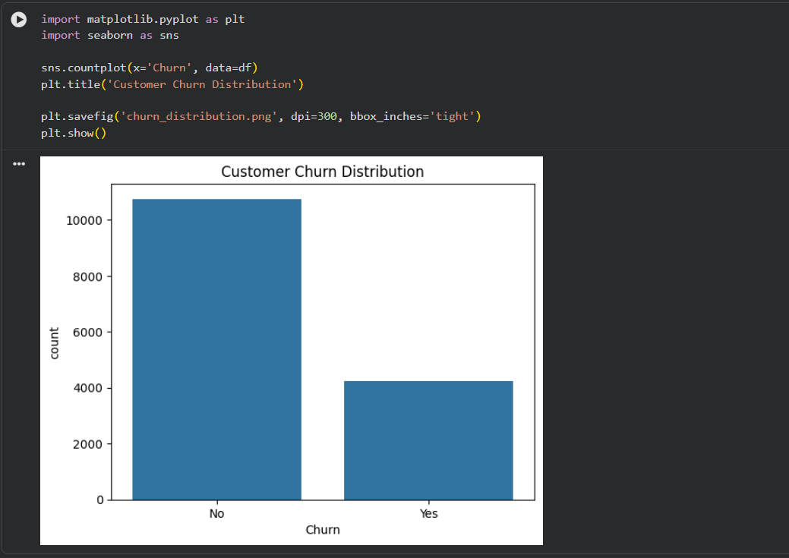
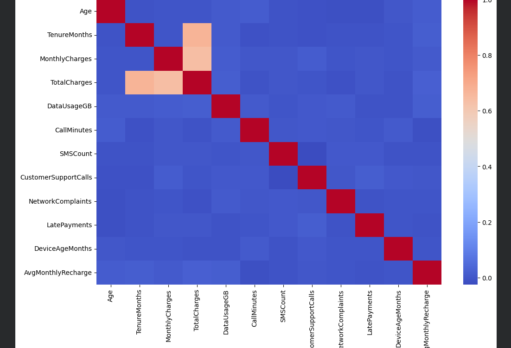
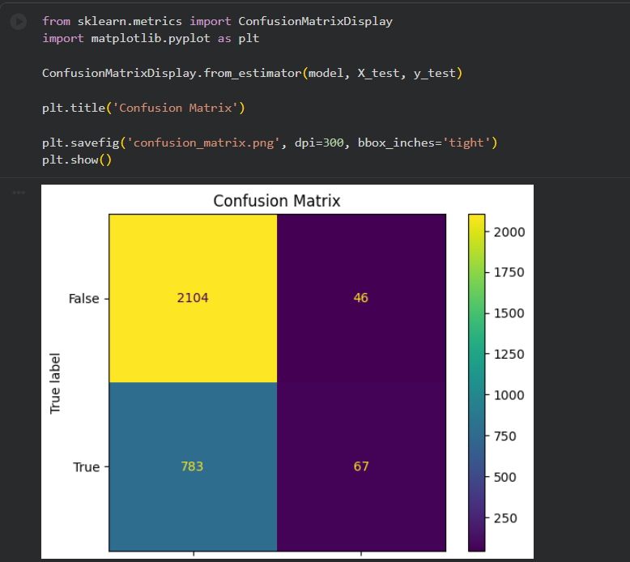
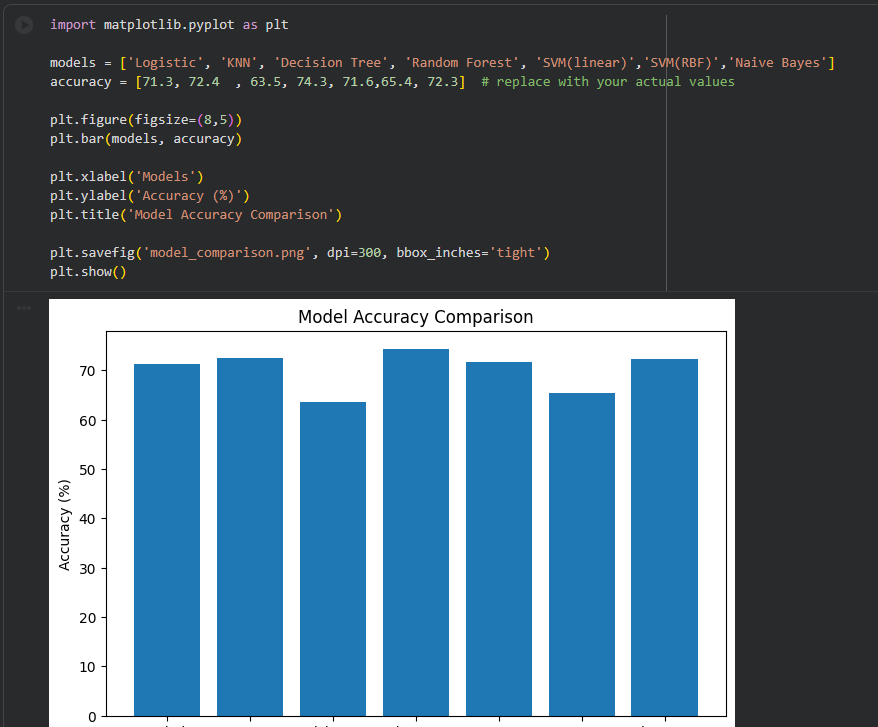

# Customer Churn Prediction

## Project Overview

This project predicts whether a telecom customer is likely to churn (leave the service) using Machine Learning classification algorithms.

The project includes data preprocessing, exploratory data analysis (EDA), feature encoding, model training, evaluation, and comparison of multiple algorithms.

---

## Dataset

- Dataset: Telecom Customer Churn Dataset
- Records: 15,000 customers
- Target Variable: Churn (Yes/No)

---

## Technologies Used

- Python
- Pandas
- NumPy
- Matplotlib
- Seaborn
- Scikit-learn
- Google Colab

---

## Machine Learning Models

The following models were implemented and evaluated:

| Model | Accuracy |
|---------|---------|
| Logistic Regression | 71.3% |
| KNN | 72.4% |
| Decision Tree | 63.5% |
| Random Forest | 74.3% |
| SVM | 65.4% |

Random Forest achieved the highest overall accuracy.

---

## Visualizations

### Customer Churn Distribution

### Correlation Heatmap

### Confusion Matrix

### Model Accuracy Comparison

---

## Key Findings

- Most customers did not churn.
- The dataset is imbalanced, with significantly more non-churn customers than churn customers.
- Monthly Charges and Total Charges show a strong positive correlation.
- Random Forest provided the best overall performance among the tested models.

---

## Limitations

Although Random Forest achieved 74.3% accuracy, the confusion matrix shows that the model struggled to identify churn customers.

Confusion Matrix Results:

- True Negatives: 2104
- False Positives: 46
- False Negatives: 783
- True Positives: 67

This indicates that the model predicts non-churn customers much better than churn customers.

The primary reason is class imbalance, where the number of non-churn customers is much higher than churn customers.

Future improvements could include:

- SMOTE oversampling
- Class weighting
- Hyperparameter tuning
- Advanced ensemble methods

---

## Author

Irfan Ahmed

AI/ML & EDA Internship Project – CADPOINT
