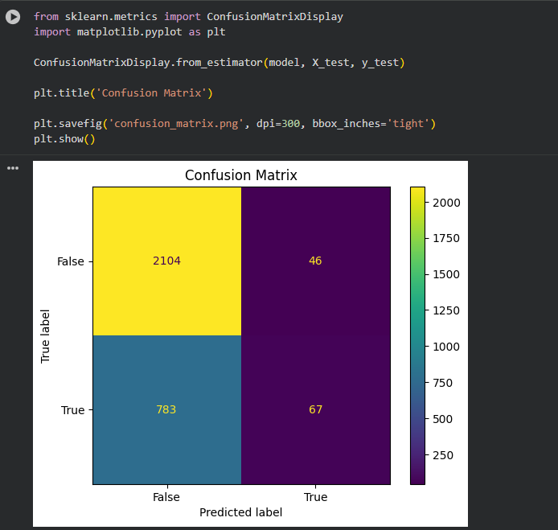

# Customer Churn Prediction

## Project Overview

This project predicts whether a telecom customer is likely to churn (leave the service) using Machine Learning classification algorithms.

The project covers data preprocessing, exploratory data analysis (EDA), feature encoding, model training, evaluation, and comparison of multiple machine learning models.

---

## Dataset

- Dataset: Telecom Customer Churn Dataset
- Records: 15,000 customers
- Target Variable: Churn (Yes/No)

---

## Technologies Used

- Python
- Pandas
- NumPy
- Matplotlib
- Seaborn
- Scikit-learn
- Google Colab

---

## Machine Learning Models Evaluated

| Model | Accuracy |
|---------|---------|
| Logistic Regression | 71.3% |
| KNN | 72.4% |
| Decision Tree | 63.5% |
| Random Forest | 74.3% |
| SVM (Linear) | 71.7% |
| SVM (RBF) | 65.4% |
| Naive Bayes | 72.3% |

Random Forest achieved the highest overall accuracy among all tested models.

---

## Visualizations

### Customer Churn Distribution

### Correlation Heatmap

### Model Accuracy Comparison

### Random Forest Confusion Matrix

---

## Key Findings

- Most customers did not churn.
- The dataset is imbalanced, containing significantly more non-churn customers than churn customers.
- Monthly Charges and Total Charges showed a strong positive correlation.
- Random Forest achieved the highest overall accuracy.
- Different models produced different churn detection performance despite similar accuracy values.

---

## Model Insights

### Random Forest

- Accuracy: 74.3%
- Best overall performing model.
- Produced the highest classification accuracy among all tested algorithms.

### Naive Bayes

- Accuracy: 72.3%
- Fast and computationally efficient.
- Struggled to identify churn customers effectively.

### SVM (Linear)

- Accuracy: 71.7%
- Failed to identify churn customers.
- Predicted nearly all customers as non-churn due to class imbalance.

### SVM (RBF)

- Accuracy: 65.4%
- Lower overall accuracy.
- Better at detecting churn customers compared to Linear SVM.
- Achieved approximately 60% recall for churn prediction.

---

## Limitations

Although Random Forest achieved the highest accuracy, customer churn prediction remains challenging due to class imbalance in the dataset.

Key challenges include:

- Fewer churn customers compared to non-churn customers.
- Models may achieve high accuracy while still missing many churn cases.
- Accuracy alone is not sufficient for evaluating churn prediction performance.

Future improvements:

- SMOTE oversampling
- Class weighting
- Hyperparameter tuning
- Feature engineering
- Ensemble optimization

---

## Conclusion

This project demonstrates the complete machine learning workflow from data preprocessing and exploratory data analysis to model evaluation and comparison.

The results show that the highest accuracy does not always indicate the best business outcome, highlighting the importance of precision, recall, and F1-score when evaluating customer churn prediction models.

---

## Author

**Irfan Ahammad J**

AI/ML & EDA Internship Project – CADPOINT
